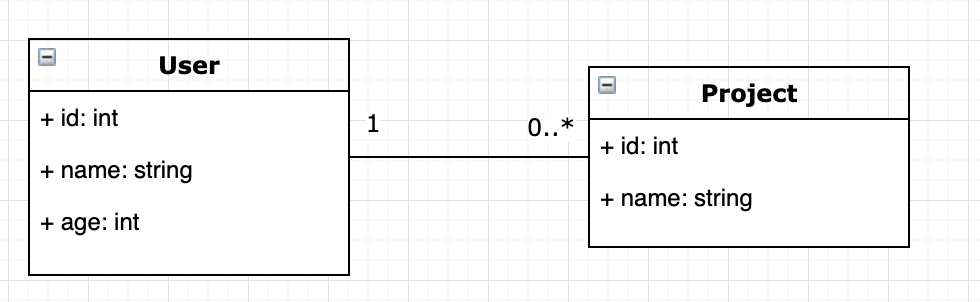

# Sequelize Boilerplate 

sequlize를 사용하는 방법을 간단하게 작성하였습니다. 

오랜만에 sequlize 사용할 일이 생겨서 사용하는데, 초기 설정을 하고, 1:N CRUD 코드를 작성하는 데에 많은 시간을 할애하였습니다. 

샘플 코드를 만들어서 다음에는 참고하면서 해보려고 합니다.

## 기본 구조

### 다음 라이브러리를 기본으로 사용합니다.
 
 - Sequelize
 - Express
 - nodejs

## 다음 테이블 구조를 가집니다.



> 예시라 project의 데이터는 수정시 삭제 후 다시 등록 합니다. 


## 실행

```
$> npm install
$> npm run start
```

## 샘플 데이터 형식

```
{
	"name": "임광규",
	"age": 30,
	"projects": [
		{ "name": "ABC Project" },
		{ "name": "DEF Project" }
		]
}
```

## CRUD 예제

### 목록 조회 

```
$> curl -XGET http://localhost:3300/api?offset=0&limit=10
```

### 데이터 등록

```
$> curl -XPOST -H 'Content-Type: application/json' http://localhost:3300/api/ -d '
 {
        "name": "임광규",
        "age": 30,
        "projects": [
                { "name": "ABC Project" },
                { "name": "DEF Project" }
                ]
}
 '
```

### 단일 데이터 조회

> 4는 user의 id를 의미 합니다.

```
$> curl -XGET http://localhost:3300/api/4
```

### 단일 데이터 수정

```
curl -XPUT -H 'Content-Type: application/json' http://localhost:3300/api -d '
 {
	"id": 4,
	"name": "임광규",
	"age": 30,
	"projects": [
		{ "name": "wwww Project" },
		{ "name": "ddddd Project" }
		]
}
 '
```

## 단일 데이터 삭제

> id 값을 기준으로 삭제 합니다.

```
$> curl -XDELETE -H 'Content-Type: application/json' http://localhost:3300/api -d '
 {
	"id": 4,
	"name": "임광규",
	"age": 30,
	"projects": [
		{ "name": "wwww Project" },
		{ "name": "ddddd Project" }
		]
}
 '
```

## 참고 내용

- [sequelize-Getting started](https://sequelize.org/v5/manual/getting-started.html)
- [Performing CRUD with Sequelize](https://dev.to/nedsoft/performing-crud-with-sequelize-29cf)
- [One-To-Many associations (hasMany)](https://sequelize.org/v5/manual/associations.html#one-to-many-associations--hasmany-)
- [Wrong count query for findAndCountAll with include #7225](https://github.com/sequelize/sequelize/issues/7225)
